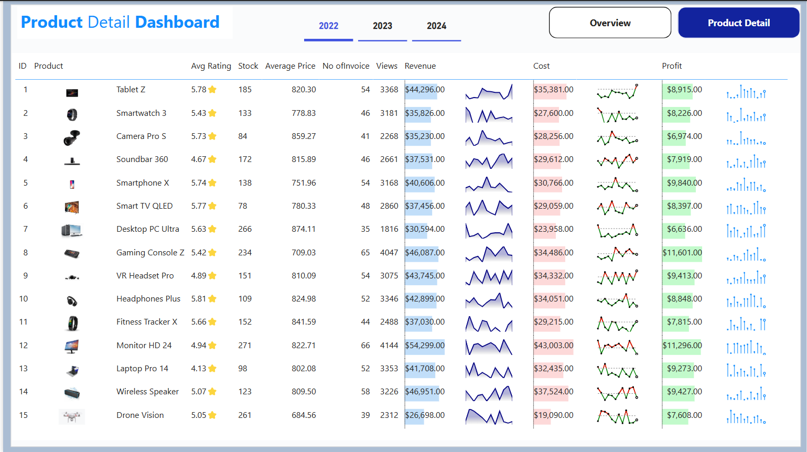

# 📊 Sales Marketing Dashboard

## 📌 Overview
The **Sales Marketing Dashboard** is a data visualization project designed to provide a comprehensive view of business performance across sales, marketing, and product dimensions. The dashboard enables stakeholders to monitor revenue, cost, profit, conversion rates, and customer engagement while drilling down into detailed product-level insights.

This project focuses on presenting complex business data in a clear, interactive, and decision-friendly format.

---

## 🎯 Project Objectives
- Track overall revenue, cost, and profit performance
- Monitor average conversion rate and customer engagement
- Analyze sales trends across months and years
- Evaluate revenue contribution by lead source and sales channel
- Measure campaign and regional performance
- Provide detailed product-level sales and profitability insights

---

## 📌 Key Metrics (Overview Dashboard)
- **Revenue:** $409.90K  
- **Cost:** $324.22K  
- **Profit:** $85.68K  
- **Average Conversion Rate:** 17.16  
- **Total Views:** 31K  

Year-based comparison is available for **2022, 2023, and 2024**.

---

## 📈 Dashboard Structure

### 1️⃣ Sales Marketing Overview
This section provides a high-level summary of sales and marketing performance, including:
- Monthly revenue trends with year-over-year comparison
- Revenue distribution by lead source (Email, Cold Calling, Website, Referral, Social Media)
- Revenue split by sales channel (Online vs In-Store)
- Campaign performance analysis
- Regional revenue distribution
- Country-level revenue and session insights

---

### 2️⃣ Product Detail Dashboard
The product detail view delivers in-depth insights at the individual product level, including:
- Product ratings and stock levels
- Average price and invoice count
- Product views and revenue contribution
- Cost and profit analysis per product
- Trend indicators for revenue, cost, and profit

This view supports detailed performance comparison and product-level decision-making.

---

## 🖼️ Dashboard Previews

### Sales Marketing Overview

### Product Detail View

---

## 🛠 Skills & Concepts Demonstrated
- Data Visualization & Dashboard Design
- Sales & Marketing Performance Analysis
- KPI Monitoring and Trend Analysis
- Product-Level Profitability Analysis
- Business Intelligence Reporting
- Insight-Driven Storytelling

---

## 📂 Repository Contents
